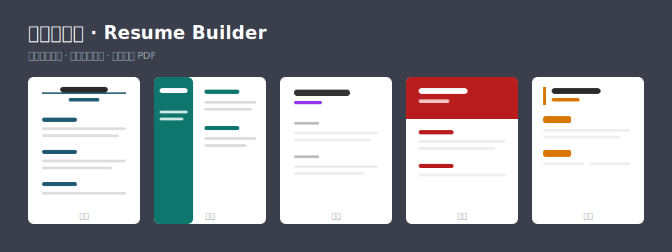

# 简历生成器 · Resume Builder

> 一个**零依赖、单文件**的在线简历生成器。打开即用，左边填内容、右边实时预览，一键切换精美模板，一键导出 PDF —— 专为快速投递（BOSS直聘 / 拉勾 / 智联等）打造。

## ✨ 特性

- **零配置，零安装** —— 没有 Node、没有 Python、没有 npm install。下载一个 `index.html`，双击用浏览器打开就能用。
- **5 套精美模板**，顶部一键切换：经典 / 现代 / 极简 / 优雅 / 紧凑。
- **8 种主题色 + 自定义取色**，配色实时整页变换。
- **所见即所得**：左侧表单编辑，右侧 A4 预览实时同步。
- **导出矢量 PDF**：走浏览器打印，中文清晰、可被招聘网站正常解析（已强制保留背景色）。
- **本地自动保存**：内容存在你自己的浏览器里，**不上传任何服务器**，关掉再打开还在。
- **导入 / 导出 JSON**：一键备份，换电脑也能恢复。
- **工作 / 项目 / 教育 / 技能** 均可增删、上下排序。

## 🚀 快速开始（三步）

1. 下载本仓库的 **`index.html`**（点右上角 `Code → Download ZIP`，或单独下载该文件）。
2. **双击用浏览器打开**（推荐 Chrome / Edge，Safari 亦可）。
3. 改成你的内容 → 选模板 / 配色 → 点 **⬇ 导出 PDF**。完成。

> 需要的"配置"：**只有一个现代浏览器**。仅此而已。

## 🖨️ 导出 PDF 的正确设置（重要）

点"导出 PDF"后会弹出浏览器打印窗口，按下面设置才能得到干净、满边的简历：

| 选项 | 设置 | 说明 |
|---|---|---|
| 目标打印机 | **另存为 PDF / Save as PDF** | |
| 边距 Margins | **无 / None** | 让色带顶到纸边 |
| 页眉和页脚 Headers and footers | **取消勾选** | 否则会多出网址、日期、标题 |
| 背景图形 Background graphics | 勾选（保险） | 本工具已用 CSS 强制开启，不勾通常也行 |

导出的文件会自动命名为 **`你的名字_简历.pdf`**，可直接上传到 BOSS直聘 的"附件简历"。

## 💡 投递小贴士

- 简历尽量**控制在一页**：内容超出一页时浏览器会自动分页，删减要点或换"紧凑"模板即可压回一页。
- 用主题色高亮**量化成果**（如"性能提升 45%"），HR 一眼能看到重点。
- 投不同岗位时，用"导出 JSON"备份多个版本，针对性微调。

## 🔒 隐私

所有数据只保存在**你本地浏览器的 localStorage**，不经过任何网络、不上传、无后端。清除浏览器数据即清空。

## 🛠️ 技术说明

- 纯 `HTML + CSS + 原生 JavaScript`，**单文件、无构建、无外部依赖**。
- 中文字体使用系统内置（苹方 / 微软雅黑 / 宋体 / 楷体），无需附带字体文件。
- 想加模板？在 `RENDER` 对象里加一个渲染函数 + 一段 `.tpl-xxx` 的 CSS，再在 `TEMPLATES` 数组里登记即可。欢迎 PR。

## 🤝 贡献

欢迎提 Issue 和 PR：新模板、新配色、字段扩展（如"获奖证书 / 自我评价"）、双语支持等。

## 📄 License

[MIT](LICENSE) —— 可自由使用、修改、分发。
